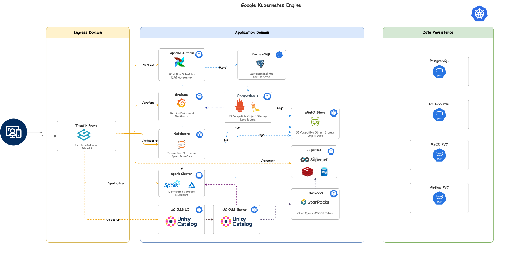

# 🚀 Cloud-Native Big Data Platform on Kubernetes (Raw K8s / AWS)

[](CHANGELOG.md)
[](README.md#🚦-project-status)

> An enterprise-grade, cloud-native orchestration framework for distributed big data workloads. Built on self-managed Kubernetes (kubeadm) on AWS EC2 with **Cilium CNI**, this platform provides a decoupled, elastic environment for **Apache Spark**, **Delta Lake**, and **Airflow**, featuring a unified suite of modern interactive notebook environments.

---

👉 **[View the v0.3.0 Changelog](CHANGELOG.md)** | **[Release Notes](RELEASES.md)**



## 📖 Introduction
This repository contains a **Data Platform as Code (DPaC)** implementation, designed to modernize distributed computing by enforcing a strict separation of compute and storage. Leveraging Kubernetes as the primary orchestration plane, the platform eliminates infrastructure silos, enabling teams to deploy and scale production-ready data ecosystems elastically.

### Architectural Core Principles:
*   **Decoupled Compute/Storage**: Persistence is offloaded to S3-compatible object storage (MinIO), allowing compute resources (Spark Executors) to remain ephemeral and cost-efficient.
*   **GitOps-Centric Design**: Every component, from networking routes to database schemas, is defined as declarative Kubernetes manifests for reproducible deployments.
*   **High Observability**: Integrated telemetry across the stack provides deep visibility into job performance, resource utilization, and system health.

---

## 🚦 Project Status

| Feature               | Status       | Notes                                           |
| :-------------------- | :----------- | :---------------------------------------------- |
| **JupyterHub / Spark** | ✅ Stable    | Core interactive environment                   |
| **Spark Connect**      | ✅ Stable    | Shared Spark gateway for all clients           |
| **Delta Lake**         | ✅ Stable    | ACID transactions and Time Travel on S3        |
| **Hive Metastore**     | ✅ Stable    | Centralized metadata management (Thrift)       |
| **Cilium CNI**         | ✅ Stable    | AWS ENI IPAM mode for native VPC networking    |
| **StarRocks**          | ✅ Stable      | Verified with Native Delta Catalog (OLAP)      |
| **Airflow + Git-Sync** | ✅ Stable      | DAGs auto-synced from Git repository           |
| **Monitoring Stack**   | 🏗 Beta      | Prometheus, Grafana, Loki, Hubble UI           |
| **Marimo Notebooks**   | 🧪 Exp       | Reactive Python UI integration                 |

> [!IMPORTANT]
> Features marked as **Experimental (🧪 Exp)** are in the development phase. They may have incomplete functionality or require additional configuration.

---

## 🏗 Architecture & Components

The platform is divided into three logical domains:

### 1️⃣ Ingress & Networking
*   **Cilium CNI**: Pod networking with AWS ENI IPAM mode. Pods receive real VPC IPs for full AWS compatibility.
*   **MetalLB**: Provides a network load-balancer implementation, assigning a dedicated Elastic IP (`18.233.93.199`).
*   **Traefik Proxy**: The unified ingress controller. Handles external traffic on ports `80`/`443` and routes it to internal services. Runs as a `LoadBalancer` service (no `hostNetwork`).
*   **Hubble UI**: Cilium's observability dashboard for real-time network flow visibility.
*   **SSLIP.IO**: Automatic DNS resolution for LoadBalancer IPs.

### 2️⃣ Application Layer (Blue Domain)
*   **Apache Airflow (2.x)**: The workflow orchestrator. It schedules DAGs that trigger Spark jobs, move data, and manage dependencies. configured with the **KubernetesExecutor** for scaling tasks.
*   **Notebook Suite**: 
    *   **JupyterHub**: Standard interactive environment with **Zeppelin features** (SQL magic, Scala kernel, `z.show()`).
    *   **Marimo**: Reactive Python notebooks with high-performance UI components.
    *   **Polynote**: IDE-focused notebook for Scala and multi-language Spark development.
*   **Apache Spark (4.0.1)**: The distributed compute engine, pre-configured with **Delta Lake** and **Hadoop 3.3.4** support.
*   **Apache Superset**: Enterprise-ready BI. Connects to the platform for data visualization.
*   **Hive Metastore (HMS)**: Standalone Thrift service acting as the central catalog for Spark and StarRocks.

### 3️⃣ Data & Persistence (Green Domain)
*   **OpenEBS (Hostpath)**: Dynamic storage provisioner that manages local node storage. Replaces static PersistentVolumes for an automated storage lifecycle.
*   **MinIO**: High-performance Object Storage (S3 Compatible). Acts as the "Data Lake" storage layer.
*   **PostgreSQL**: The relational metadata backbone. Stores state for Airflow, Superset, and Hive.
*   **Redis**: In-memory cache used by Superset.
*   **StarRocks**: High-performance analytical (OLAP) database. Reads directly from MinIO via Delta Native Catalog.
*   **Kong Gateway (Experimental)**: Secondary API gateway for external service management.

---

## 🛠 Tech Stack

| Component | Version | Role | Usage |
| :--- | :--- | :--- | :--- |
| **Apache Airflow** | `2.10.x` | Orchestrator | Scheduling ETL pipelines |
| **Spark / Delta** | `4.0.1 / 4.0.1` | Compute / Format | Distributed processing & ACID tables |
| **Hadoop / AWS SDK** | `3.3.4 / 2.20.160` | Storage Access | S3A FileSystem optimizations |
| **JupyterHub** | `4.0.7` | Notebooks | Standard Data Engineering workflow |
| **Marimo / Polynote** | `latest` | Notebooks | Reactive & Multi-language environments |
| **Hive Metastore** | `3.1.3` | Catalog | Metadata persistence |
| **StarRocks** | `v3.x` | OLAP Database | Sub-second queries on large datasets |
| **Apache Superset** | `4.0.x` | BI / Viz | Dashboards & Analytics |
| **MinIO** | `RELEASE.2024` | Object Store | Data Lake (S3 API) |
| **Traefik / Kong** | `v2.10 / v3.x` | Ingress/API Gateway | Load Balancing & Service Routing |
| **Prometheus / Loki** | `Custom Helm` | Observability | Metrics & Centralized Logging |
| **Grafana** | `latest` | Dashboards | Visualizing cluster health & job metrics |

---

## ⚡ Deployment Guide

### Prerequisites
1.  **AWS EC2 Cluster**: Self-managed Kubernetes via `kubeadm` on EC2 instances (ARM64 Graviton recommended).
2.  **Tools**: `kubectl`, `helm` installed locally.
3.  **Permissions**: Admin access to the cluster (`KUBECONFIG` configured).

### Step 1: Clone & Configure
```bash
git clone https://github.com/your-repo/k8s-big-data-platform.git
cd k8s-big-data-platform
```

### Step 2: Build Custom Images (Crucial)
The platform uses optimized images for notebooks and executors. Build and push them to your registry. If you want to customize these images (e.g. adding specific spark dependencies or Python libraries), explore and modify the Dockerfiles within the `docker/` folder before running these scripts:
```bash
# Spark Executor & Driver Base
docker/spark/build.sh

# User Interfaces
docker/jupyterhub/build.sh
docker/marimo/build.sh
```

### Step 3: Deploy Platform
Run the main deployment script. This automation handles namespace creation, CRD installation, and Helm chart deployments.
```bash
chmod +x deploy-v2.sh
./deploy-v2.sh
```
*Wait for the script to complete. It may take 5-10 minutes for the LoadBalancer IP to provision.*

### Step 3: Access Services
The script will output the dynamic URLs for your services. The base domain `$INGRESS_DOMAIN` is constructed automatically using the LoadBalancer IP (e.g., `18.233.93.199.sslip.io`).

| Service | URL Pattern | Default Credentials |
| :--- | :--- | :--- |
| **Airflow** | `http://airflow.<INGRESS_DOMAIN>` | `admin` / `admin` |
| **JupyterHub** | `http://jupyterhub.<INGRESS_DOMAIN>` | No token (Dev Mode) |
| **Superset** | `http://superset.<INGRESS_DOMAIN>` | `admin` / `admin` |
| **Minio** | `http://minio.<INGRESS_DOMAIN>` | `minioadmin` / `minioadmin` |
| **Grafana** | `http://grafana.<INGRESS_DOMAIN>` | `admin` / `prom-operator` |
| **Spark UI** | `http://spark.<INGRESS_DOMAIN>` | - |
| **Spark History** | `http://spark-history.<INGRESS_DOMAIN>` | - |
| **Hubble UI** | `http://hubble.<INGRESS_DOMAIN>` | - |
| **K8s Dashboard** | `https://dashboard.<INGRESS_DOMAIN>` | See token below |

### Kubernetes Dashboard Token

Generate a token for K8s Dashboard access:

```bash
# One-time setup: Create admin-user service account
kubectl apply -f - <<EOF
apiVersion: v1
kind: ServiceAccount
metadata:
  name: admin-user
  namespace: default
---
apiVersion: rbac.authorization.k8s.io/v1
kind: ClusterRoleBinding
metadata:
  name: admin-user-binding
roleRef:
  apiGroup: rbac.authorization.k8s.io
  kind: ClusterRole
  name: cluster-admin
subjects:
- kind: ServiceAccount
  name: admin-user
  namespace: default
EOF

# Generate token (GKE limits to 48h max)
kubectl create token admin-user -n default --duration=48h
```

Copy the output token and paste it into the Dashboard login page.

---

## 📊 Observability

The platform comes with a pre-configured monitoring stack:
*   **Prometheus Operator**: Automatically scrapes metrics from Spark applications and system components.
*   **ServiceMonitors**: Defines <i>what</i> to monitor (Spark Driver/Executors, Airflow scheduler, Nodes).
*   **Grafana Dashboards**: Custom JSON dashboards are provided to visualize:
    *   JVM Heap usage
    *   Active Tasks / Executors
    *   CPU/Memory saturation

👉 **[Read the Full Monitoring Guide](MONITORING_GUIDE.md)**

---

## 🔌 Connecting to Data (Superset)

Superset is pre-connected to the internal Postgres and Hive Metastore.
*   **To query Data Lake files**: Use the Hive connector.
*   **To query Metadata**: Use the Postgres connector.

👉 **[Read the Superset Connection Guide](SUPERSET_CONNECTION_GUIDE.md)**

---

## 📂 Repository Structure
```bash
├── docker/                   # Custom image source code and Dockerfiles (Customize here!)
│   ├── jupyterhub/           # Notebook environment with Spark & Scala
│   ├── marimo/               # Reactive Python notebook
│   └── spark/                # Golden Spark image
├── deploy-v2.sh              # Main automation script
├── k8s_diagram.drawio.svg    # Architecture Diagram
├── k8s-platform-v2/          # V2 Source of Truth (Kustomize)
│   ├── 00-core/              # Namespaces, OpenEBS StorageClasses, PVCs
│   ├── 01-networking/        # Cilium, MetalLB, Traefik, Hubble UI
│   ├── 02-database/          # Postgres, MinIO (S3), Redis
│   ├── 03-apps/              # Airflow, Spark Connect, JupyterHub, Superset
│   ├── 04-configs/           # Global configs, Spark defaults, Ingress domain
│   └── 05-monitoring/        # Prometheus, Grafana, Loki
├── docs/                     # Detailed technical guides
│   ├── notebooks.md          # Guide: JupyterHub, Marimo
│   ├── delta_lake.md         # Guide: ACID tables on S3
│   ├── spark_on_k8s.md       # Deep Dive: Spark Client vs Cluster mode
│   └── airflow.md            # Workflow orchestration
├── airflow-dags/             # Airflow DAG definitions
├── scripts/                  # Utility scripts
├── CHANGELOG.md              # Version history with detailed changes
├── ISSUES.md                 # Known issues and resolutions
├── MONITORING_GUIDE.md       # Observability instructions
├── README.md                 # Entry point (this file)
└── SUPERSET_CONNECTION_GUIDE.md # BI connectivity instructions
```

---

## 📚 Documentation & References

| Document | Description |
| :--- | :--- |
| **[Changelog](CHANGELOG.md)** | Version history with detailed changes per release |
| **[Issues & Resolutions](ISSUES.md)** | Troubleshooting log of known bugs and fixes |
| **[Deployment Guide](DEPLOYMENT.md)** | Step-by-step installation instructions |
| **[JupyterHub Guide](JUPYTERHUB_GUIDE.md)** | PySpark jobs and executor configuration |
| **[Monitoring Guide](MONITORING_GUIDE.md)** | Prometheus, Grafana, and Loki setup |
| **[Superset Connection](SUPERSET_CONNECTION_GUIDE.md)** | BI tool data source connections |
| **[Lakehouse Architecture](LAKEHOUSE_README.md)** | HMS + StarRocks + Spark architecture |
| **[Docker Images](docker/README.md)** | Build, customize, and version Docker images |
| **[Platform Docs](docs/README.md)** | Full documentation index |

## 🔧 Manual DAG Deployment (Bypass Git-Sync)

For rapid development and testing, you can bypass the Git synchronizer and manually upload DAGs directly to the cluster. This is useful when you want to test changes immediately without committing to the repository.

### 1. Identify the Git-Sync Pod
The `airflow-git-sync` pod has write access to the DAGs volume.

```bash
kubectl get pods -n default -l app=airflow-git-sync
# Example Output: airflow-git-sync-5669c94965-t52rx
```

### 2. Upload Files
Use `kubectl exec` to pipe file contents directly to the pod (this bypasses some read-only/ownership issues with `kubectl cp`).

**Syntax:**
```bash
cat <local-file> | kubectl exec -i -n default <git-sync-pod-name> -- tee /dags/repo/dags/<filename> > /dev/null
```

**Example:**
```bash
# Upload DAG file
cat airflow-dags/dags/my_dag.py | kubectl exec -i -n default airflow-git-sync-5669c94965-t52rx -- tee /dags/repo/dags/my_dag.py > /dev/null

# Upload Spark Manifest
cat airflow-dags/dags/my_manifest.yaml | kubectl exec -i -n default airflow-git-sync-5669c94965-t52rx -- tee /dags/repo/dags/my_manifest.yaml > /dev/null
```

> [!WARNING]
> Changes made this way are **ephemeral** and will be overwritten the next time the Git-Sync sidecar pulls from the remote repository. Always commit your final changes to Git.

---

## 🔧 Spark Configuration Management

The `spark-production-defaults` ConfigMap provides global defaults for all Spark applications. When you make changes to `production-spark-defaults.conf`, you must sync them to the cluster:

```bash
# Update ConfigMap from local file
kubectl create configmap spark-production-defaults --from-file=spark-defaults.conf=production-spark-defaults.conf --dry-run=client -o yaml | kubectl apply -f -
```

